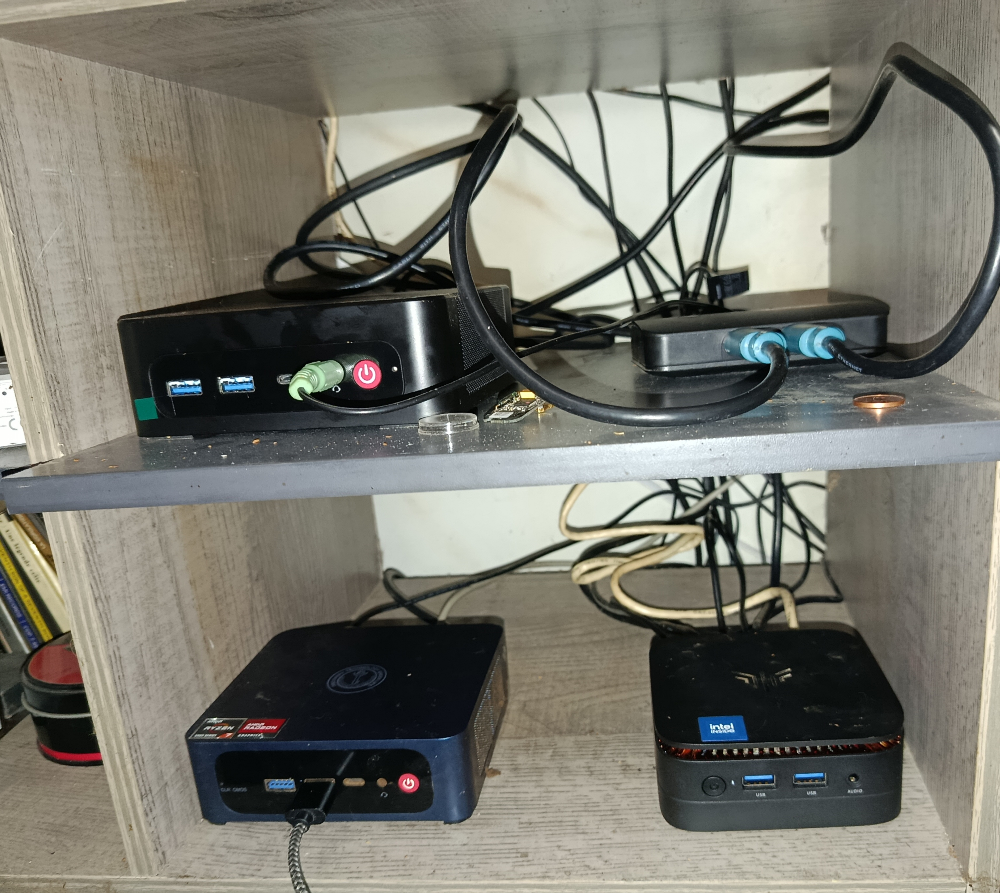
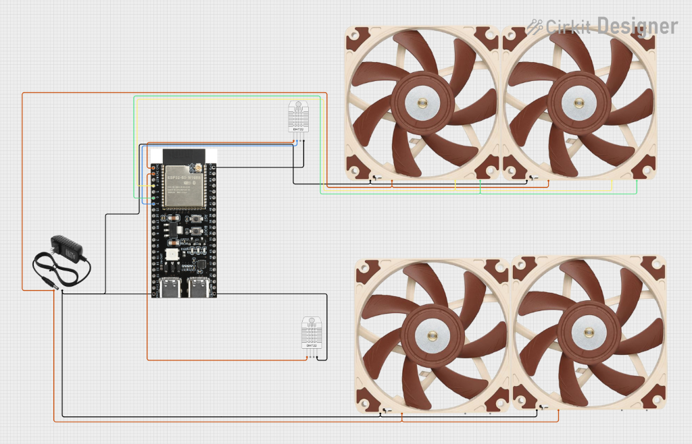
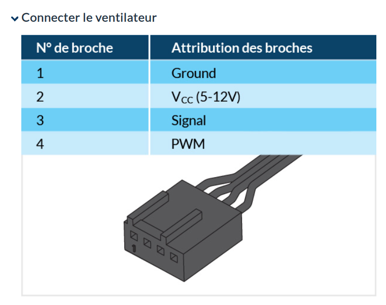
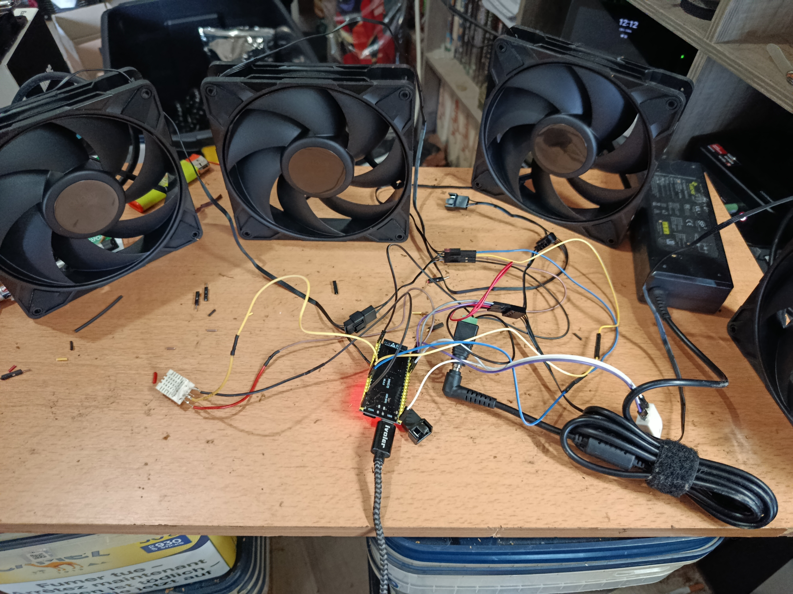

# 📚 Tutoriel d'Installation : Ventilation Baie de Brassage (V2 - Dual Zone)

Ce guide détaille l'installation de la version **V2 (Dual Zone)** du système de ventilation. Cette version permet de piloter **deux lignes de ventilateurs indépendantes** (Haut et Bas) pour refroidir efficacement votre équipement (Mini PCs, Switchs, etc.).

---

## � Aperçu du Projet

**L'objectif** : Refroidir la zone des équipements (Mini PCs ci-dessous) grâce à un montage piloté.

---

## �🛠️ Matériel Requis

*   **ESP32** (Modèle S3 ou standard)
*   **Ventilateurs PWM** : ARCTIC P14 Pro PST(4 fils standard)
*   **Alimentation 12V** Dédiée ventilateurs
*   **Capteurs de Température DHT22** (x2)

---

## ⚡ Schéma de Câblage (V2)

Voici le schéma global de principe pour le raccordement de l'ESP32 avec les deux lignes de ventilateurs.

### 1. Alimentation
*   **ESP32** : Via USB ou Vin (5V)
*   **Ventilateurs** : Raccordez le **GND** et le **12V** directement à l'alimentation externe.
    *   ⚠️ **IMPORTANT** : Reliez le GND de l'alim 12V au GND de l'ESP32 (masse commune).

### 2. Ventilateurs (Pinout)

Référez-vous à l'image ci-dessous pour identifier les câbles de vos connecteurs ventilateurs standards (PWM).

**Raccordement sur l'ESP32 :**

| Composant | Fil Ventilateur | Pin ESP32 | Fonction |
| :--- | :--- | :--- | :--- |
| **Ligne 1 (Haut)** | PWM (Bleu) | **GPIO 6** | Contrôle Vitesse |
| | Tach (Vert/Jaune) | **GPIO 4** | Retour Vitesse (RPM) |
| **Ligne 2 (Bas)** | PWM (Bleu) | **GPIO 35** | Contrôle Vitesse |
| | Tach (Vert/Jaune) | **GPIO 36** | Retour Vitesse (RPM) |

### 3. Capteurs de Température (DHT22)

| Composant | Pin DHT22 | Pin ESP32 |
| :--- | :--- | :--- |
| **DHT Ligne 1** | DATA | **GPIO 7** |
| **DHT Ligne 2** | DATA | **GPIO 37** |

---

## 🧪 Validation & Tests (Banc d'essai)

Avant l'installation finale dans la baie, il est recommandé de valider le montage "sur table" comme ci-dessous. Cela permet de vérifier que les RPM remontent bien et que les sondes réagissent.

### Check-list de vérification :
1.  **RPM** : Faites tourner les ventilateurs à la main, la valeur doit s'afficher dans HA.
2.  **Température** : Soufflez sur les capteurs, la courbe doit monter.
3.  **Commandes** : Testez le Slider Manuel et le Boost.

---

## 💻 Installation Logicielle

1.  **Fichiers YAML** :
    *   Assurez-vous que `ventilation_v2.yaml` et `.base.yaml` sont dans votre dossier ESPHome.
    *   Vérifiez l'adresse IP statique dans `ventilation_v2.yaml`.

2.  **Dashboard** :
    *   Utilisez le fichier **`ventilation_card.yaml`** fourni.
    *   Copiez les *templates* et la configuration de la vue *Sections*.
